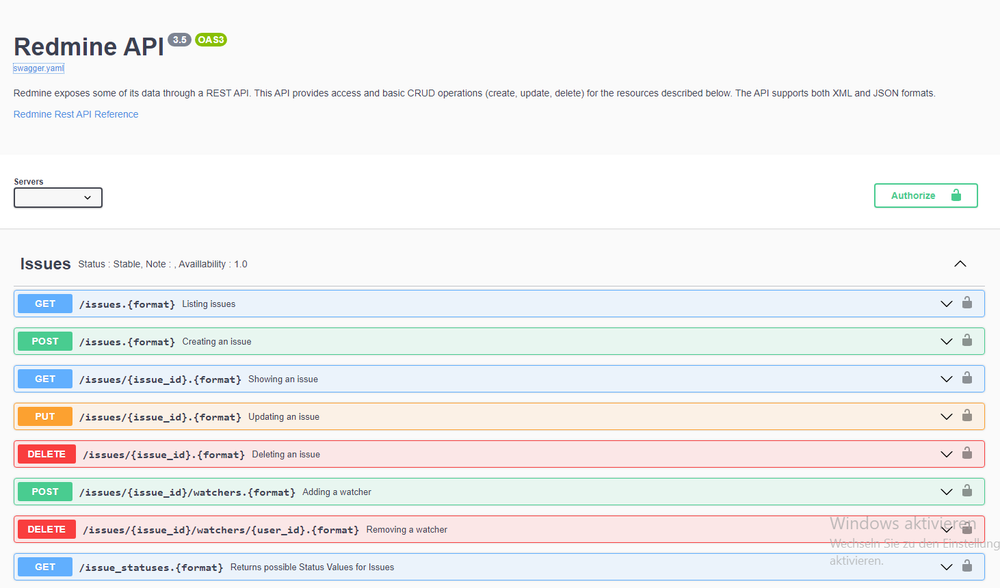

<div align=left>
  <h1>Redmine Swagger API</h1>
  <p>A swagger api definition for the redmine rest API.
    Work in progress</p>
</div>
<p align="left">
    <a target="_blank" href="https://morpheus235.github.io/redmine-swagger-api/" alt="Swagger-API">
        </a>
 </p>



### Usage

```shell
git clone https://github.com/Morpheus235/redmine-swagger-api
```
#### OR
```shell
https://morpheus235.github.io/redmine-swagger-api/swagger.yaml
```
### Useful links:
#### Swagger Codegen
- https://swagger.io/tools/swagger-codegen/
#### Swagger Docs
- https://swagger.io/docs/
